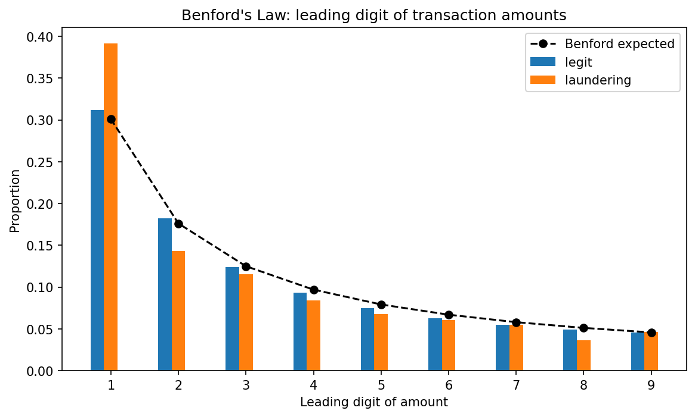

# AML Graph: Detecting Money-Laundering Typologies in a Bank-Transaction Graph

I modeled about 5 million bank transactions as a graph to detect money-laundering patterns, using Cypher queries in Neo4j and a machine learning model, and I report honestly on what worked and what didn't.

> **Educational project.** Data: IBM "Transactions for Anti-Money Laundering (AML)" (HI-Small), a synthetic dataset from IBM Research. Not affiliated with any institution. Findings are illustrative. This pipeline flags transactions for human review. It does not declare any transaction guilty.

## The problem

Money laundering is a needle-in-a-haystack problem. Only a tiny fraction of transactions are criminal, almost nothing is labeled in the real world, and analysts can only review a handful of cases a day. The goal is to rank transactions so the most suspicious ones rise to the top. I wanted to test one question: does modeling transactions as a network, and looking at structure, help catch laundering better than looking at each transaction on its own?

## The data

I used IBM's synthetic AML dataset (HI-Small). It comes with the laundering patterns labeled, so I can check my results against them.

- **5,078,345** transactions, of which **0.10%** (5,177) are laundering. That is extreme class imbalance.
- **515,080** accounts.
- Payment types: Cheque, Credit Card, ACH, Cash, Reinvestment, Wire, Bitcoin, across 15 currencies.
- Laundering follows **8 known typologies** across **370 rings**, which I used as a validation key.

Two data-quality findings shaped the work:
- Laundering is concentrated in **ACH** transfers (0.75% of ACH is laundering vs ~0.1% overall). I believe this is an artifact of the synthetic data. In real life I would expect laundering not to concentrate in a single payment type, though I am not certain. So I use ACH as a feature but do not treat it as a real-world rule.
- The data is **front-loaded**. About 4.5M transactions fall in Sept 1-10, then volume collapses (down to 8 on Sept 18) while the laundering rate jumps to 90-100%. That tail is a degenerate artifact (laundering edges timestamped after the legitimate traffic stopped), so I dropped it from the modeling.

## What I did

1. **Built the graph.** I removed self-loops (account-to-itself transactions, about 81% of them "Reinvestment", the rest spread across ACH, Bitcoin and others). This dropped 11 laundering transactions, about 0.2% of all laundering, which I disclose as a small loss. Then I aggregated repeated payments between the same pair into one edge, and built a directed graph: **422,726 account nodes** and **647,939 money-flow edges**. I loaded it into **Neo4j**.
2. **Detected typologies with Cypher.** I wrote one query per laundering typology and checked each against the planted rings.
3. **Built graph features.** For each account I computed in-degree, out-degree, and PageRank. These are structural only. I did not build any feature from the laundering labels, so there is no leakage.
4. **Trained a model.** I used XGBoost on a temporal split inside the realistic window (train Sept 1-8, test Sept 9-10), and compared transaction-only features against transaction plus graph features. I scored with PR-AUC and recall on the laundering class, not accuracy.
5. **Ran a forensic check.** I applied Benford's Law to the transaction amounts.

## What I found

### 1. Cypher catches the planted typologies

I detected and visualized four typologies (see `figures/`), each checked against the patterns file:

| Typology | What it is | Example / validation |
|---|---|---|
| **Fan-out** | One account sprays money to many (smurfing) | Top hit `800737690` is the 16-degree fan-out planted in the patterns file |
| **Fan-in** | Many accounts funnel into one (consolidation) | ~16 senders, 100% laundering edges |
| **Cycle** | Money loops back to its origin (round-tripping) | Multi-hop loops returning to the start |
| **Gather-scatter** | A hub gathers from many, then scatters to many (mixing) | Laundering on both the in and out side |

One important refinement: raw out-degree surfaces large legitimate hubs (banks), so I rank the detectors by the fraction of laundering, which separates the deliberate rings from high-volume institutions.

### 2. Graph structure improves the model a lot

On a clean temporal split with no leakage:

| Model | Features | Laundering recall | PR-AUC |
|---|---|---|---|
| Baseline | transaction only (22) | 0.841 | **0.058** |
| + Graph | transaction + graph (28) | 0.843 | **0.281** |

Adding six structural graph features (sender and receiver degree and PageRank) raised **PR-AUC about 5x** (0.06 to 0.28). Feature importance shows `PaymentFormat_ACH` dominates (the synthetic artifact), but the sender's out-degree (`from_out`) is the second most important feature overall and the top graph feature. That is the fan-out signal directly.

This is different from a dataset where the tabular features are already strong (like the Elliptic crypto data, where simple graph features add little). Here the transaction fields are weak and the laundering is almost purely structural, so the network features carry most of the signal. The graph lift is the more generalizable finding. The ACH signal is specific to this dataset.

### 3. Laundering amounts break Benford's Law

Legitimate transaction amounts follow Benford's Law closely. Laundering amounts deviate, with an excess of amounts starting with 1 (about 39% vs the expected 30%) and a shortfall of 2s. That is consistent with manufactured or structured values. It is a second, independent signal on top of the network structure. The effect is modest and the laundering sample is small, and this is synthetic data, so I treat it as a screening flag, not proof.

## How laundering stages map to the typologies

- **Placement** (getting illicit funds into the system): fan-in and smurfing deposits.
- **Layering** (hiding the trail): cycles (round-tripping), gather-scatter (mixing), stacking chains.
- **Integration** (funds re-enter looking clean): consolidation into accounts that then spend normally.

## What an analyst does with this

If I were the analyst, I would start from the model and look at the top accounts, the ones with the most transactions and the most fraudulent ones. Each method points me somewhere. The Cypher detectors point to specific laundering rings to investigate. The model (using features like PageRank) ranks transactions by how suspicious they are. And the Benford check flags amounts that look designed rather than natural. Flagging all of this is the useful part. After that, a human in the loop reviews each case, and only then do we actually decide whether it is fraud or a genuine transaction. None of these methods decides that on its own. They decide where the analyst looks first.

## Limitations

There are some limitations to this report:

- This is all synthetic data. The ACH concentration and the Benford effect are features of the simulator that generated it, so on real data I cannot assume I would see the same patterns.
- The performance is modest (PR-AUC 0.28). A graph neural network or typology-specific features would likely give a better PR-AUC, so that is where I would do more work.
- I computed the graph features on the full transaction graph. Next time I would compute them only from the training window.

## Stack

Python (pandas, networkx, scikit-learn, xgboost, matplotlib), Neo4j and Cypher. PR-AUC and recall for heavy class imbalance, and a temporal split to avoid leakage.

## Reproduce

1. Download the IBM AML HI-Small dataset (`HI-Small_Trans.csv`, `HI-Small_Patterns.txt`) from Kaggle into `data/` (see `data/DOWNLOAD_DATA.md`).
2. Run `analysis.ipynb` top to bottom (explore, build graph, export CSVs, features, model, Benford).
3. Load `data/graph_nodes.csv` and `data/graph_edges.csv` into Neo4j and run `cypher/typologies.cypher` to see how the transaction networks of the different typologies look.
